# 🛒 ShopEase - Next.js E-Commerce Platform


A high-performance, fully responsive e-commerce storefront built with Next.js 15 (App Router) and Tailwind CSS. This project serves as a comprehensive online shopping experience, featuring advanced product filtering, dynamic cart and wishlist management, simulated checkout flows, and a sleek, modern UI.

---

## 👨‍💻 Intern Information
- **Intern ID:** CITS3982
- **Name:** Sumeet Kailash Chauhan
- **Internship Domain:** React.js Web Development
- **Organisation:** CODTECH IT Solutions Pvt. Ltd.
- **Duration:** 6 Weeks (06 June 2026 – 18 July 2026)

---

## ✨ Key Features

### 🛍️ Advanced Product Discovery
- **Dynamic Product Grid:** View products with engaging hover animations and "Quick Add" actions.
- **Search & Filtering:** Real-time search and multi-parameter filtering (by Category, Price Range, and Sorting).
- **URL Syncing:** Search queries and active filters automatically persist via Next.js `useSearchParams`.

### ❤️ Cart & Wishlist Management
- **Global Cart Context:** Add, remove, and adjust product quantities instantly across the entire application.
- **Wishlist Context:** Save favorite items globally with interactive heart toggle buttons.
- **Dynamic Badges:** Live counters in the navigation bar automatically reflect total cart and wishlist items.

### 💳 Simulated Checkout Experience
- **Step-by-Step Checkout:** Seamlessly transition from Cart -> Shipping -> Payment -> Order Confirmation.
- **Form Validation:** Polished, accessible UI forms for shipping and billing details.
- **Order Confirmation:** Beautifully styled success page summarizing the finalized order.

### 🎨 Modern UI/UX
- **Fully Responsive:** Mobile-first Tailwind CSS design ensuring flawless layouts on phones, tablets, and desktops.
- **Clean Animations:** Smooth page transitions, toast notifications, and interactive micro-animations using Framer Motion.
- **Premium Footer & Newsletter:** A robust footer with quick links and a functioning newsletter subscription UI.

---

## 🛠️ Technology Stack

| Layer | Technology |
|---|---|
| **Framework** | Next.js 15 (App Router) |
| **Styling** | Tailwind CSS v4, Lucide React / React Icons |
| **State Management** | React Context API (`CartContext`, `WishlistContext`) |
| **Notifications** | React Hot Toast |
| **Data Source** | Mocked internal JSON dataset |

---

## 📂 Folder Structure

```text
codtech-nextjs-ecommerce/
├── app/                  # Next.js App Router Pages
│   ├── about/            # About us page
│   ├── cart/             # Shopping cart page
│   ├── checkout/         # Simulated checkout flow
│   ├── products/         # Product listing & dynamic detail pages [id]
│   ├── profile/          # User profile settings
│   ├── wishlist/         # Saved favorite products
│   ├── layout.js         # Root layout with global Providers and Navbar/Footer
│   └── page.js           # Home page with hero and featured products
├── components/           # Reusable UI elements
│   ├── checkout/         # Shipping, Payment, and Summary forms
│   ├── layout/           # Navbar, Footer, Mobile Menu
│   ├── productDetail/    # Product image gallery, specifications, info
│   ├── products/         # Product Grid, Filter Sidebar, Sort Bar
│   └── ui/               # Buttons, Product Cards, Breadcrumbs
├── context/              # Global React Contexts
│   ├── CartContext.jsx   # Shopping Cart logic
│   └── WishlistContext.jsx # Wishlist logic
├── data/                 # Application data
│   └── products.js       # Extensive mock product database
├── public/               # Static assets & images
└── screenshots/          # Application screenshots
```

---

## 🚀 Getting Started

### Prerequisites
- Node.js (v18 or higher)
- npm or yarn

### Installation

1. **Clone the repository:**
   ```bash
   git clone https://github.com/SumeetChauhan27/CODTECH.git
   cd CODTECH/codtech-nextjs-ecommerce
   ```

2. **Install dependencies:**
   ```bash
   npm install
   ```

3. **Run the development server:**
   ```bash
   npm run dev
   ```

4. **Open in browser:**
   Navigate to `http://localhost:3000`

5. **Build for Production (Optional):**
   ```bash
   npm run build
   npm start
   ```

---

## 📸 Screenshots

### 🏠 Storefront & Discovery
- **Home Page:** Beautiful hero section and featured categories.
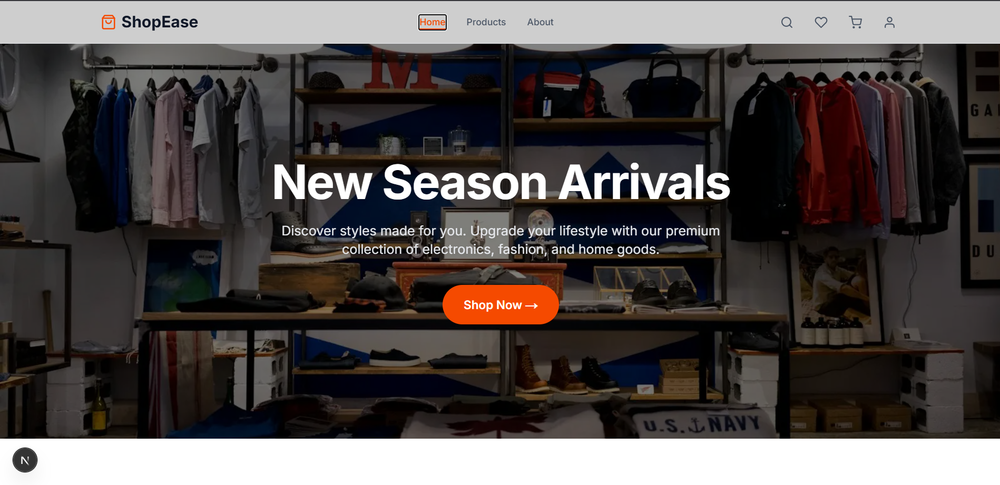
- **Featured Products:** Interactive product carousels.
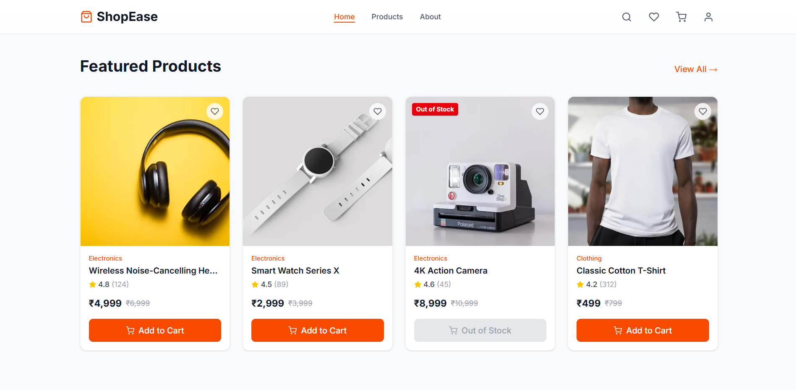
- **Product Listing:** Browse all products with powerful sidebar filtering.
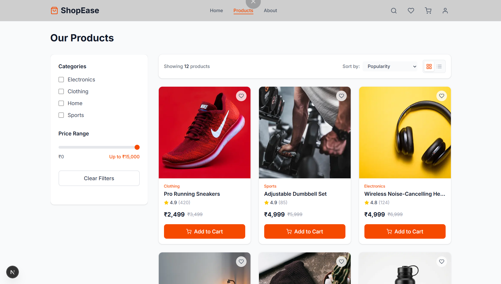
- **Categories:** Clean category segmentation.
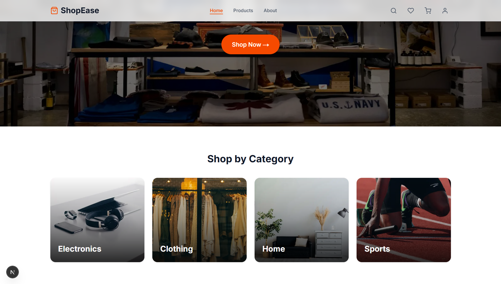

### 🛒 Shopping Experience
- **Shopping Cart:** Review selected items and manage quantities.
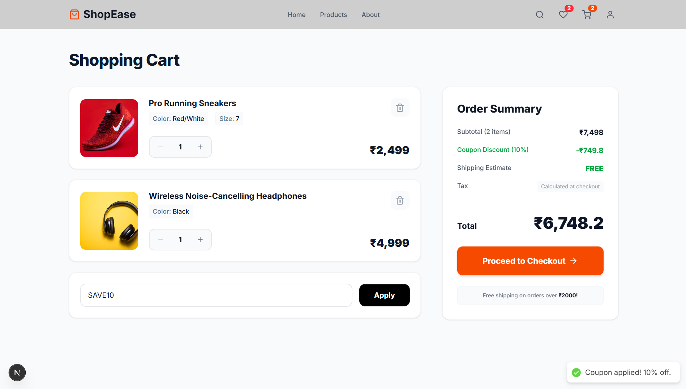
- **Wishlist:** Dedicated page for all saved favorite products.
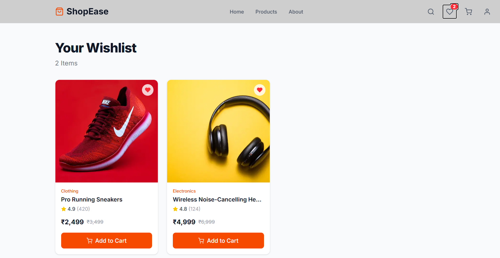

### 💳 Checkout Flow
- **Checkout Process:** Seamlessly input shipping and payment details.
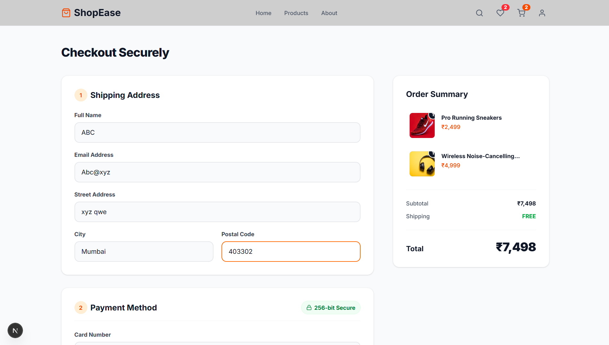
- **Order Confirmation:** Success screen after completing the mock transaction.
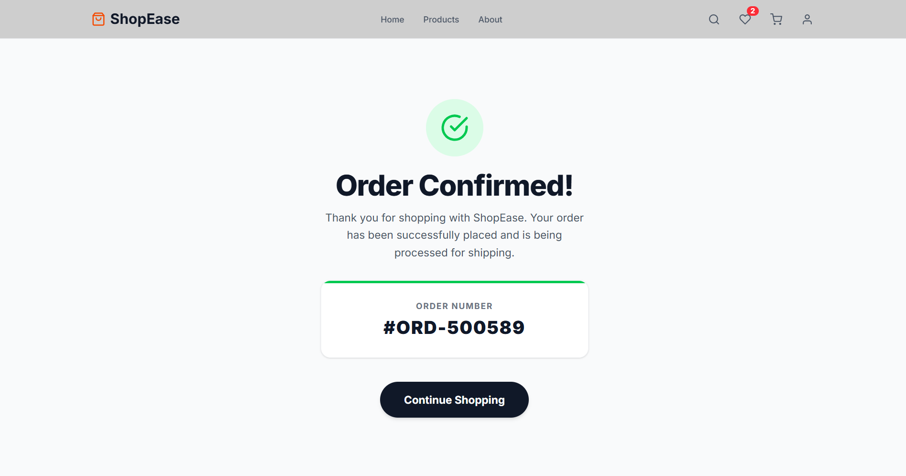

### 👤 User Pages & UI
- **My Account:** User profile placeholder.
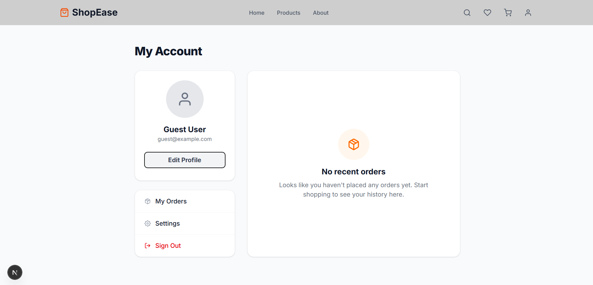
- **About Us:** Information about the storefront.
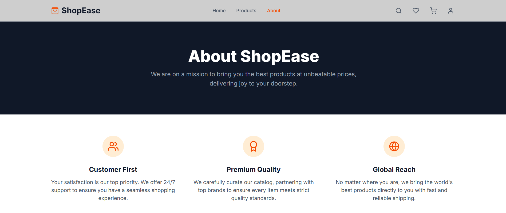
- **Footer:** Robust footer with newsletter subscription.
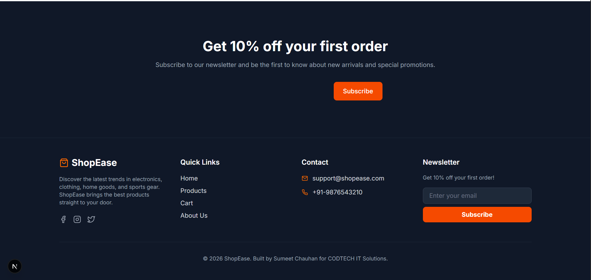

---

## 🤝 Contributing
Contributions, issues, and feature requests are welcome!

## 📜 License
This project is open-source and available under the [MIT License](LICENSE).

---
**Crafted with ❤️ by Sumeet Chauhan for CODTECH IT Solutions.**
