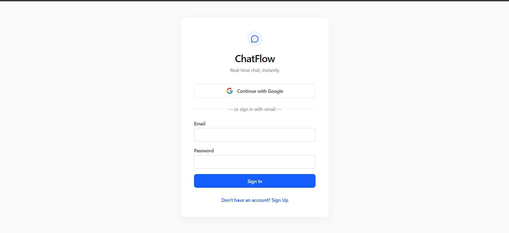
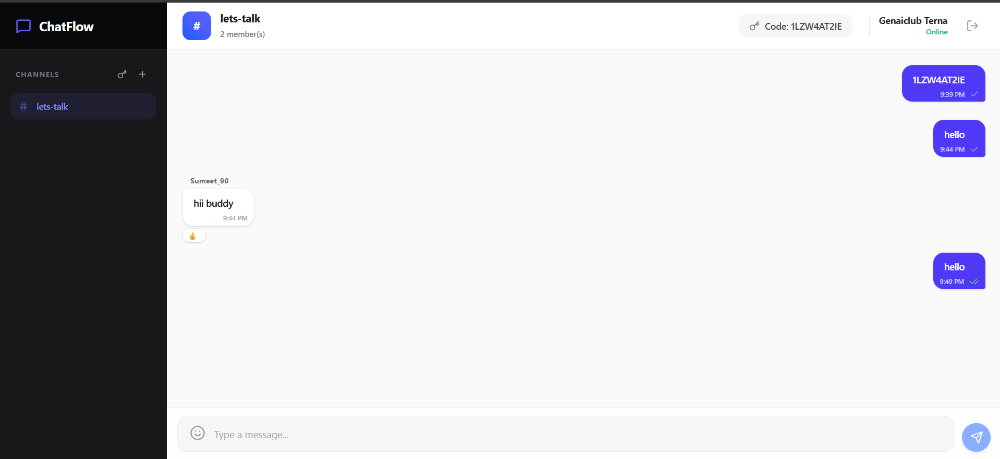
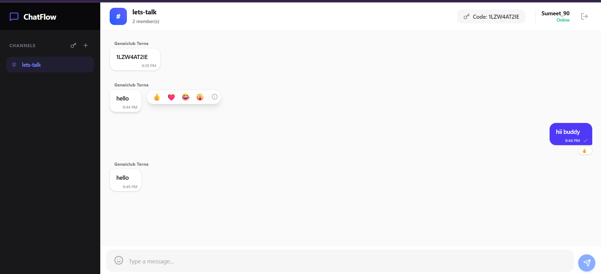

# ChatFlow - Real-Time Chat Application

<div align="center">
  
  <br />
  <br />
  
  <br />
  <br />
  
</div>

## Overview
ChatFlow is a highly interactive, premium real-time chat application built for the **COD-Tech IT Internship Program** (Task 3). It features instant messaging, secure private rooms with an invite code system, granular read receipts, and real-time emoji reactions, all wrapped in a sleek, glassmorphic UI.

## ✨ Key Features

- **Real-Time Sync:** Lightning-fast message delivery powered by Firebase Firestore.
- **Authentication System:** Secure Google OAuth and Email/Password login flows via Firebase Auth.
- **Private Rooms & Admin Approvals:** 
  - Rooms are entirely private and invisible to non-members.
  - Room creators can securely share a **10-digit alphanumeric invite code**.
  - Users can request to join rooms using the code.
  - Creators get a dedicated UI dashboard to **Approve or Reject** pending join requests.
- **Advanced Group Read Receipts:** 
  - Single tick for sent.
  - Bright green double-tick **only** when *every single member* of the private room has opened and read the message.
- **"Message Info" Timestamps:** Deeply detailed logs of exactly who read or reacted to a message and at what exact time (similar to WhatsApp's Message Info screen).
- **Emoji Board & Quick Reactions:** 
  - Full Emoji Picker integrated into the chat input.
  - Quick-hover reactions on individual messages with live reaction counters.
- **Premium UI/UX:** Built with Tailwind CSS and Framer Motion for fluid, glassmorphic animations, floating UI elements, and a clean typography system.

## 🛠 Tech Stack

- **Core:** React 18, Vite
- **Styling & Animation:** Tailwind CSS v4, Framer Motion, Lucide React (Icons)
- **Backend as a Service:** Firebase (Firestore Database, Firebase Authentication)
- **Routing:** React Router v6
- **Utilities:** `date-fns` (time formatting), `emoji-picker-react`

## 🚀 Setup Instructions

1. **Clone the repository:**
   ```bash
   git clone <your-repo-url>
   cd codtech-realtime-chat-app
   ```

2. **Install dependencies:**
   ```bash
   npm install
   ```

3. **Set up Firebase:**
   - Create a Firebase project at [console.firebase.google.com](https://console.firebase.google.com/).
   - Enable **Firestore Database** (start in Test Mode or configure proper security rules).
   - Enable **Authentication** (Google & Email/Password providers).
   - Copy your Firebase config credentials.

4. **Environment Variables:**
   - Create a `.env` file in the root directory.
   - Add your Firebase keys:
     ```env
     VITE_FIREBASE_API_KEY=your_api_key
     VITE_FIREBASE_AUTH_DOMAIN=your_auth_domain
     VITE_FIREBASE_PROJECT_ID=your_project_id
     VITE_FIREBASE_STORAGE_BUCKET=your_storage_bucket
     VITE_FIREBASE_MESSAGING_SENDER_ID=your_messaging_sender_id
     VITE_FIREBASE_APP_ID=your_app_id
     VITE_FIREBASE_MEASUREMENT_ID=your_measurement_id
     ```

5. **Run the development server:**
   ```bash
   npm run dev
   ```

## 🔐 Firestore Security Rules (Recommended)
If moving to production, secure your database with rules like these:
```javascript
rules_version = '2';
service cloud.firestore {
  match /databases/{database}/documents {
    match /rooms/{roomId} {
      allow read: if request.auth != null;
      allow write: if request.auth != null;
      
      match /messages/{messageId} {
        allow read, write: if request.auth != null;
      }
    }
  }
}
```

## 👨‍💻 Author
**Sumeet Kailash Chauhan**  
*COD-Tech IT Internship Project*
