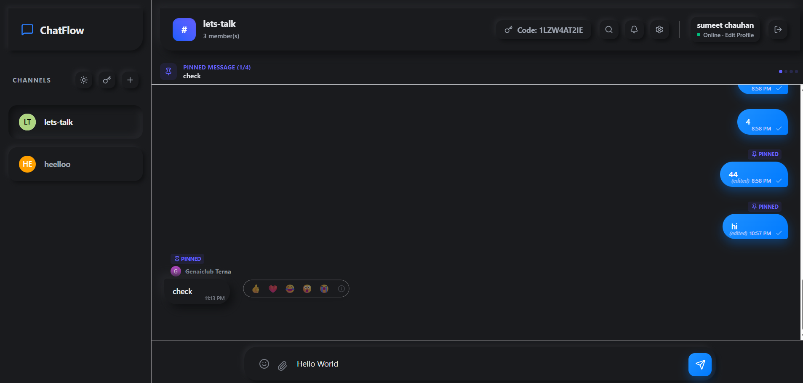
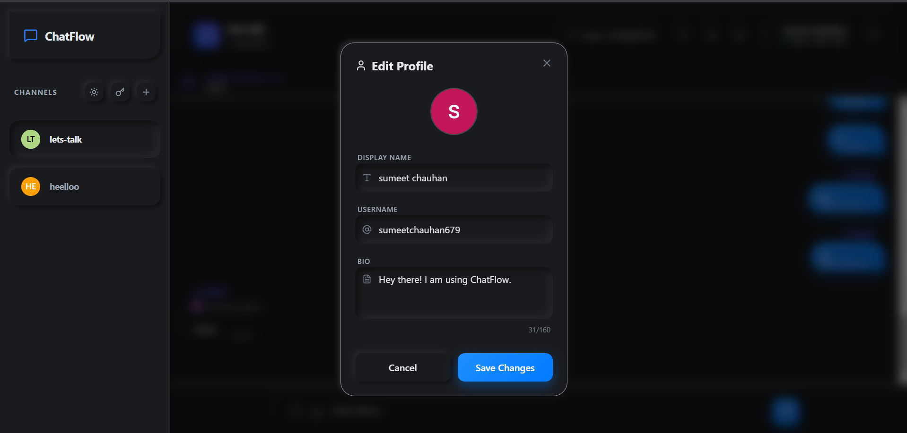

# 💬 ChatFlow - Real-Time Chat Application


A highly interactive, premium real-time chat application built for the **COD-Tech IT Internship Program** (Task 3). It features instant messaging, secure private rooms with an invite code system, granular read receipts, presence tracking, advanced pinning, and real-time emoji reactions, all wrapped in a sleek, glassmorphic UI.

---

## 🌐 Live Deployment
Experience the application live here:
### **👉 [ChatFlow Live Demo](https://chatflow-gules-delta.vercel.app/)**

---

## 👨‍💻 Intern Information
- **Intern ID:** CITS3982
- **Name:** Sumeet Kailash Chauhan
- **Internship Domain:** React.js Web Development
- **Organisation:** CODTECH IT Solutions Pvt. Ltd.
- **Duration:** 6 Weeks (06 June 2026 – 18 July 2026)

---

## ✨ Key Features

### 🔐 Authentication & Security
- **Google & Email Login:** Secure authentication using Firebase Auth.
- **Protected Routes:** Route guards redirect unauthorized users to the login page automatically.

### 🏠 Real-Time Rooms & Communities
- **Global & Private Rooms:** Create public spaces or secure private rooms.
- **Invite Code System:** Private rooms generate a 10-digit alphanumeric code. Users must enter this code to join.
- **Creator Controls:** The room creator can rename rooms, toggle room privacy, regenerate invite codes, or delete the room permanently for everyone.

### 💬 Messaging Experience
- **Real-Time Sync:** Instant message delivery using Firebase Firestore `onSnapshot`.
- **WhatsApp-Style Read Receipts:** A single tick for sent, double tick for delivered, and **double blue tick** when everyone in the room has read the message.
- **Message Info Modal:** Right-click a message to see exactly *who* read it and at what *time*.
- **Emoji Reactions:** Quick-react to any message with emojis.
- **Context Menus:** Right-click messages to Copy, Star, Pin (creator only), or Delete (your own messages).
- **Image Sharing & Lightbox:** Drag-and-drop or select images to share. Click on any shared image to view it in full screen with a beautiful lightbox viewer.

### 📌 Advanced Message Pinning
- **Duration Customization:** Pin messages for 24 Hours, 7 Days, or 30 Days.
- **Pinned Message Banner:** Important messages are pinned in a sticky banner at the top of the chat area.
- **Collapsible Pinned Panel:** Access a comprehensive, searchable horizontal panel showing all pinned messages in the room with expiration tracking.

### 🟢 Real-Time Presence & Idle Detection
- **Online/Away Status**: Automatically tracks user mouse movement and keyboard inputs to mark active users as `Online` or `Away` (idle for 5+ minutes).
- **Status Indicators**: Color-coded indicator dots (Green: Online, Amber: Away, Gray: Offline) next to user avatars.
- **Typing Indicators**: Displays real-time typing status (e.g. "Sumeet is typing...") as users type messages.

### 🔍 Search & Customization
- **In-Room Message Search:** Quickly locate past conversations by querying keywords directly in the room search modal.
- **Profile Customization:** Users can edit their display names, avatar URLs, status bios, and toggle light/dark theme preferences dynamically.
- **Glassmorphic UI & Micro-Animations:** Premium design with smooth page transitions, hover effects, and bouncy badges using Framer Motion.

---

## 🛠️ Technology Stack

| Layer | Technology |
|---|---|
| **Framework** | React 19, Vite |
| **Styling** | Tailwind CSS v4, Lucide React (Icons) |
| **Animations**| Framer Motion |
| **Backend & DB**| Firebase Auth, Firebase Firestore |
| **Routing** | React Router v7 |
| **State Management** | React Context API (`AuthContext`) |

---

## 📂 Folder Structure

```text
codtech-realtime-chat-app/
├── public/              # Static assets
├── screenshots/         # App screenshots
├── src/
│   ├── assets/          # Internal images and SVG icons
│   ├── components/
│   │   ├── chat/
│   │   │   ├── ImageDropzone.jsx       # Drag & drop area for image sharing
│   │   │   ├── ImageLightbox.jsx       # Full-screen image viewer modal
│   │   │   ├── MessageInput.jsx        # Chat input with emoji picker and uploads
│   │   │   ├── MessageList.jsx         # Renders messages, context menus, read receipts
│   │   │   ├── MessageSearchModal.jsx  # Full-text in-room search modal
│   │   │   ├── PinDurationModal.jsx    # Modal for selecting pinning durations
│   │   │   ├── PinnedMessageBanner.jsx # Sticky banner for pinned messages
│   │   │   ├── PinnedMessagesPanel.jsx # Collapsible pinned messages viewer
│   │   │   ├── RoomSettingsModal.jsx   # Room name, privacy, and code controls
│   │   │   └── TypingIndicator.jsx     # Typing indicator indicator animation
│   │   ├── layout/
│   │   │   ├── NotificationDropdown.jsx # Real-time notification lists
│   │   │   └── Sidebar.jsx             # Room navigation and creation
│   │   └── profile/
│   │       ├── ProfileEditModal.jsx    # Form for updating user details
│   │       └── ProfileViewModal.jsx    # Modal for viewing another user's bio
│   ├── context/
│   │   └── AuthContext.jsx             # Global Firebase authentication state
│   ├── hooks/
│   │   ├── useIdle.js                  # Idle and presence tracking hook
│   │   ├── useImageUpload.js           # Firebase image storage hook
│   │   └── useTypingIndicator.js       # Typing status listeners hook
│   ├── pages/
│   │   ├── ChatPage.jsx                # Main application layout and state
│   │   └── LoginPage.jsx               # Authentication entry point
│   ├── routes/
│   │   └── ProtectedRoute.jsx          # Route guard for authenticated users
│   ├── services/
│   │   └── firebase.js                 # Firebase app initialization and exports
│   ├── App.jsx                         # Router configuration
│   ├── index.css                       # Global Tailwind directives
│   └── main.jsx                        # Application entry point
├── .env.example         # Template for Firebase configuration
├── .gitignore           # Git ignore rules
├── package.json         # Project dependencies and scripts
├── README.md            # Project documentation
└── vite.config.js       # Vite bundler configuration
```

---

## 🚀 Getting Started

### Prerequisites
- Node.js (v18 or higher)
- npm or yarn

### Installation

1. **Clone the repository:**
   ```bash
   git clone https://github.com/SumeetChauhan27/CODTECH.git
   cd CODTECH/codtech-realtime-chat-app
   ```

2. **Install dependencies:**
   ```bash
   npm install
   ```

3. **Set up Environment Variables:**
   Copy the `.env.example` file to a new file named `.env` and fill in your Firebase project credentials.
   ```env
   VITE_FIREBASE_API_KEY=your_api_key
   VITE_FIREBASE_AUTH_DOMAIN=your_auth_domain
   VITE_FIREBASE_PROJECT_ID=your_project_id
   VITE_FIREBASE_STORAGE_BUCKET=your_storage_bucket
   VITE_FIREBASE_MESSAGING_SENDER_ID=your_messaging_sender_id
   VITE_FIREBASE_APP_ID=your_app_id
   ```

4. **Run the development server:**
   ```bash
   npm run dev
   ```

5. **Open in browser:**
   Navigate to `http://localhost:5173`

---

## 📸 Screenshots

### 🔐 Login & Authentication
A premium, glowing glassmorphic interface supporting secure Google Sign-in and custom Email login.


### 💬 Chat Feed & Main Workspace
Renders real-time message sync, rich text messages with copy/star context menus, image previews, and online status indicators.


### ⚙️ Interactive Feature Set
Right-click messages to pin them, react with emojis, inspect read timestamps, or access custom room management menus.


### 👤 Profile Customization Modal
Allows instant username, status message, bio, avatar editing, and switching dynamically between Dark Mode and Light Mode.


---

## 🗺️ Roadmap & Missing Features
The following features are currently missing but are planned for future updates:
- 👥 **Direct Messaging (1-on-1 Private Chats):** Start direct, private 1-on-1 conversations with other users outside of room environments.
- 🎙️ **Voice Messages (Push-to-Talk):** Record, send, and playback audio voice notes directly within the chat feed.
- 🧵 **Threaded Replies (Slack-Style):** Organize discussions by replying directly to messages, keeping main channels clutter-free.
- 🔗 **Rich Link Previews:** Automatically parse URLs sent in chat to generate visual cards with titles, descriptions, and thumbnails.
- 👤 **Read Receipt Avatars:** Inline indicator showing mini-avatars of users next to messages up to where they've read.
- 📞 **WebRTC Audio/Video Calls:** Real-time peer-to-peer calling capabilities directly inside rooms.

---

## 🤝 Contributing
Contributions, issues, and feature requests are welcome!

---

## 📜 License
This project is open-source and available under the [MIT License](LICENSE).

---

## 👨‍💻 Author
Sumeet Kailash Chauhan — [@SumeetChauhan27](https://github.com/SumeetChauhan27)

---
**Crafted with ❤️ by Sumeet Chauhan for CODTECH IT Solutions.**
